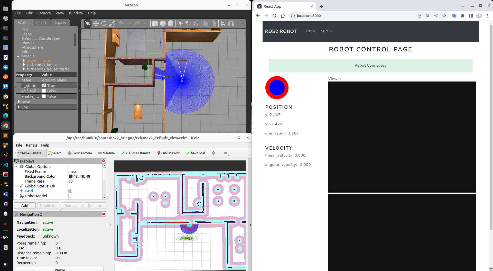
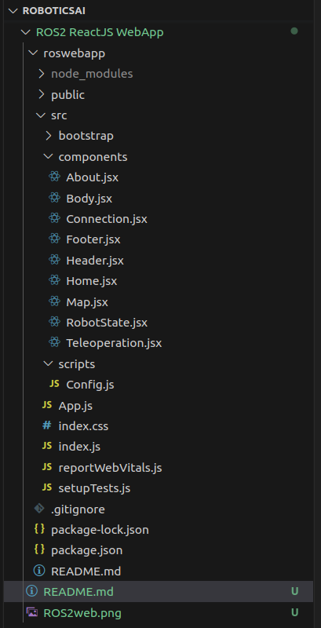

# ROS2 Projcts


## 1. ROS2 Web Application with ReactJS


### navigation and control of the ROS2 robot with web application




> Why React 
- Benefit of using react, we receive any information about the position of the robot on the map or new information about the orientation of the robot 
or the velocity of the robot, we can update web page without the need to reload the whole application.

> Overview
- This Project is complete using ROS2 and ReactJS
- Gazebo and Rviz used for robot simulation
- Frontend web page that controls the robot is build on ReactJS
- Here we are using  <code>Robot Web Tools</code> for ROS Javacript Library, 
  this includes <code>ros2d, roslib ros-nav2d</code>
- Rosbridge server provides WebSocket which is bidirectional communication layer between clients (web browsers) and servers.
- This acts as gateway between ROS2 and Web applications.

```sh
ros2 launch turtlebot3_gazebo turtlebot3_house.launch.py 
ros2 launch turtlebot3_navigation2 navigation2.launch.py use_sim_time:=True map:=ros2save/maps/my_house.yaml 
ros2 launch rosbridge_server rosbridge_websocket_launch.xml 
```

> Step 1 - react component -> Connection
 - Create a React project <code>npx create-react-app roswebapp</code> and install required dependence for ROS2

- We create a component called connection which will display whether the Web application is connected to the bridge or not.
- This will communicate to ROS on <code>"ws://"+ROSBRIDGE_SERVER_IP+":"+ROSBRIDGE_SERVER_PORT+""</code>
- This is indicated in the image above as robot connected in green 

> Step 2 - react component -> Teleoperation
- Here we use ReactJS library Joystick to control the robot from web page 
- We wite JS code for ROS2 publish on topic message <code>"geometry_msgs/Twist"</code>
- Able to control the robot from Joystick

> Step 3 - react component -> RobotState
- Here we subscriber to <code>"geometry_msgs/msg/PoseWithCovarianceStamped"</code> & <code>"nav_msgs/msg/Odometry"</code>
- This will give us the **Position** and **Velocity** of the ROS2 robot 

> Step 4 - react component -> Map
- Here we use JS library **ros-nav2d** for Robot Navigation
- IN PROGRESS
    - Error  getting Map from /robot_pose through robot_state_publisher 
    - possible issue with sync on ros-nav2d

<br>

> Code files snap




- Reource
    - [robotwebtools](https://robotwebtools.github.io/)
