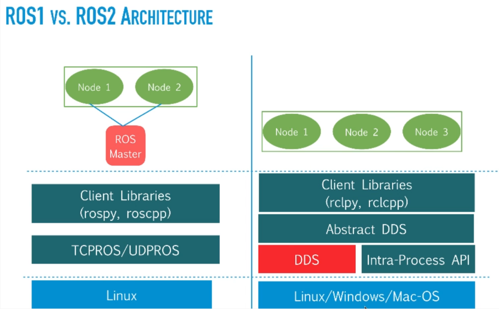
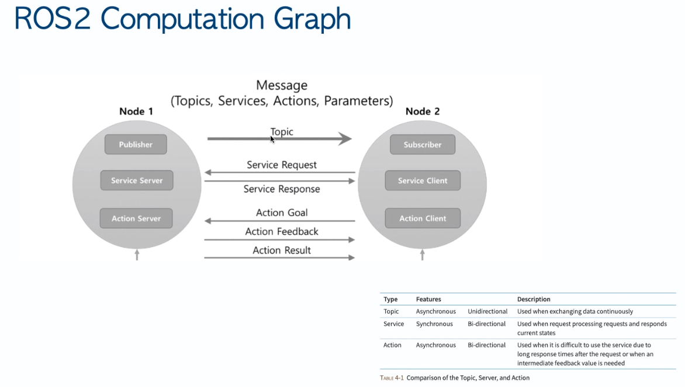
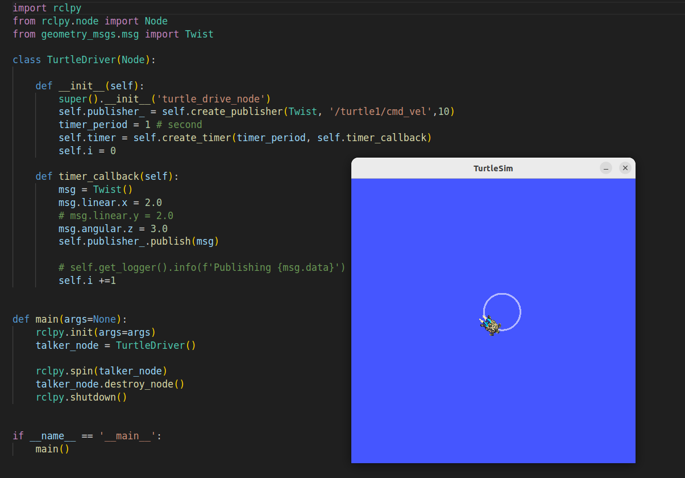

# ROS2 Projcts

## 1. ROS2 Turtlesim using Launch File

### Controling ROS2 Turtlesim using Launch File

> Overview 
- ROS2 is language agnostic and uses DDS  as neworking middleware

- ROS2 Computation Graph

- Create a package <code>ultimate_pkg</code> and node <code> turtle_driver.py</code>
- Generate a launch file and use the launch file to run the code instead of doing it manually by command prompt 
- Update setup.py with launch path module name  and entry point
- Update package.xml 

- Launch Turtlesim using launch file <code>ros2 launch ultimate_pkg turtle_task.launch.py</code>

