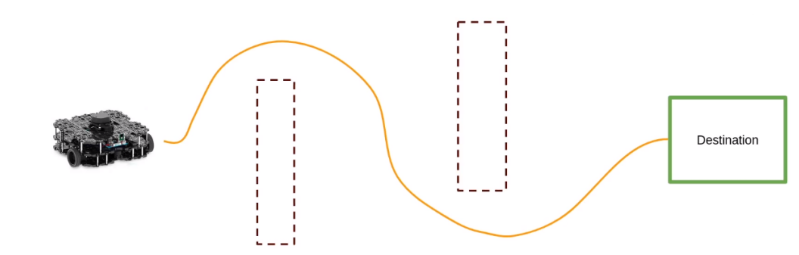

# ROS2 Projcts

## 1. ROS2 with SLAM and NAV2 

Interact Programmatically with Nav2 Stack 

https://www.youtube.com/watch?v=1kV-rZZw50Q

<iframe width="480" height="420" src="https://www.youtube.com/embed/1kV-rZZw50Q" title="NVIDIA’s New AI Trained" frameborder="10" allow="accelerometer; autoplay; clipboard-write; encrypted-media; gyroscope; picture-in-picture; web-share" allowfullscreen></iframe>

 

Navigation 2 stack 2 step process
