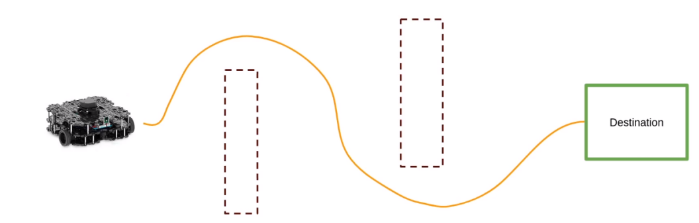
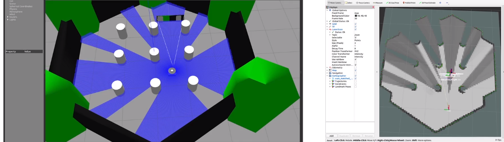
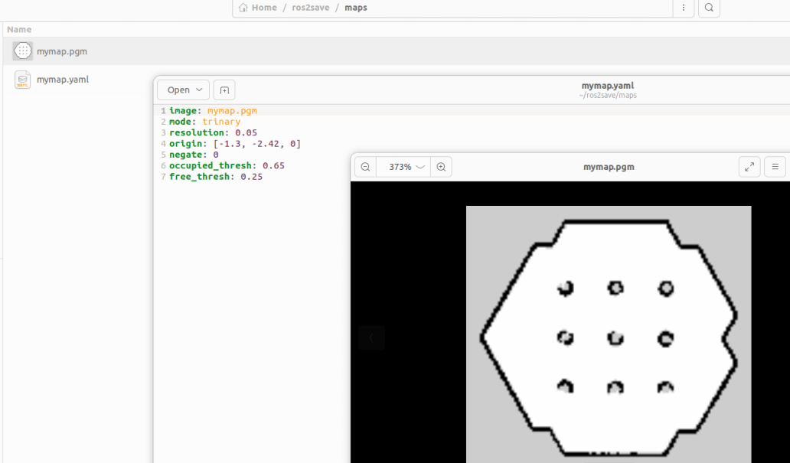
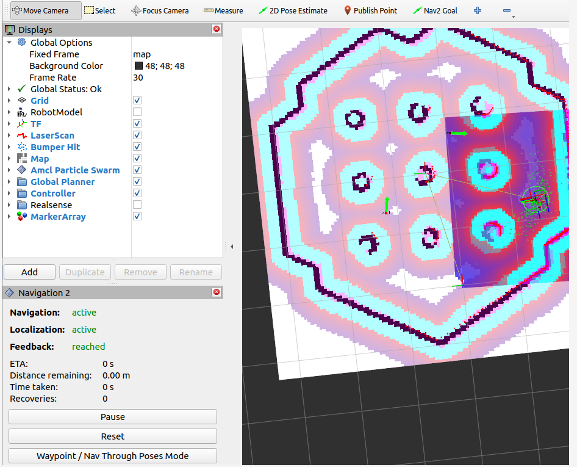
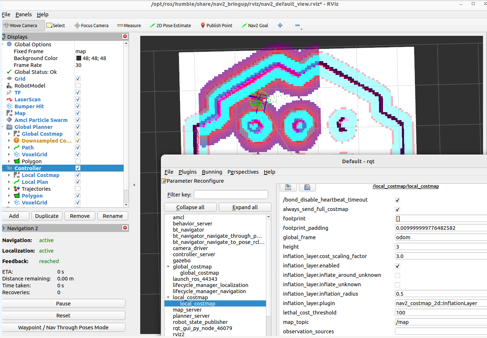
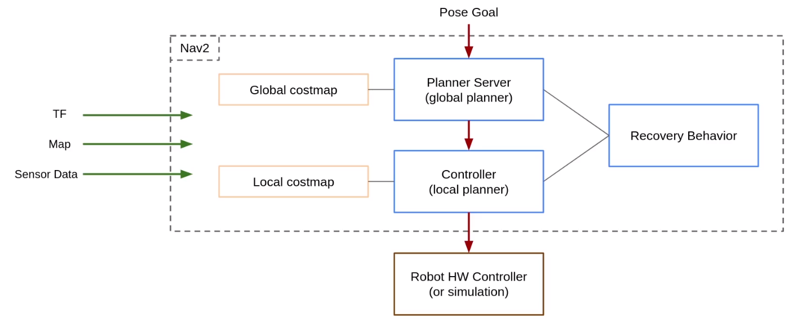

# ROS2 Projcts


## 1. ROS2 with SLAM and NAV2 


> Click here to watch demo video

> [https://www.youtube.com/watch?v=1kV-rZZw50Q]

[](https://www.youtube.com/watch?v=1kV-rZZw50Q "")


### Nav2 stack two step process

1. Create a map (with SLAM) 
2. Make the robot navigate from point A to point B




Launch turtlebot3 with Gazebo teleop Rviz


```sh
goku@gokud:~$ ros2 launch turtlebot3_gazebo turtlebot3_world.launch.py 
goku@gokud:~$ ros2 run turtlebot3_teleop teleop_keyboard 
goku@gokud:~$ ros2 launch turtlebot3_cartographer cartographer.launch.py use_sim_time:=True 
```

* Gazebo represent the real world with all the physics
* Rviz is viualization tool 
* Map is genrated as the robot move in the world
* teleop_keyboard node to control the robot



```sh
goku@gokud:~$ ros2 run nav2_map_server map_saver_cli -f ros2save/maps/mymap

```
- Save your map. Here gray is unknow places, black is the obstacle, white is know space

- We know pixel value lies between 0-255  <code> 255*65% = 165.75  </code>  

- If the pixel value is above 165.75 then it is considered occupied and below 63.75 is not occupied

- resolution is meter per pixel that is one pixel is 0.05 meter  that is 5cm = 1 pixel




### Now Let's make the robot navigate using the map 

We will start the simulation on gazebo and start the navigation stack and give it the map that we have already generated 

```sh
ros2 launch turtlebot3_gazebo turtlebot3_world.launch.py 
ros2 launch turtlebot3_navigation2 navigation2.launch.py use_sim_time:=True map:=ros2save/maps/mymap.yaml 

```


- At this point we can provide 2D Pose Estimate based on the Gazebo location of the robot 
- We can give the required waypoints or navigation goal
- Add objects on Gazebo to see how the robot avoid obstacle dynamically 


### Let's understand Global Planner and Local Planner 

- Blue line is local planner and pink line is the global planner 
- Robot will use a path that have low cost
    - Image pixel having object will have high cost like red pixel then blue pixel and finally white with low cost 
- Global plan is updated every 1 or 2 seconds (1hz)
- Now the plan will be send to local planner where controller will have it's local costmap 
- Local planner is updated at 20-100hz and does it's best to follow the global plan 
- We can tune the costmap using the parameter of the path planner <code>rqt on terminal</code>
-  some of the key parameter that can be updated are 
    - publish_frequency
    - update_frequecny
    - inflation_layer.inflation_radius (reducing this robot can go closer to the obstacles)
    - 





### Recovery Behavior

- A recovery behavior try to fix the current issue so that the robot can continue to reach the destination goal.
- 


### Transforms TFs  and important frames

- In a robot we will have different frames representing the different parts of the robot.


### Nav2 Architecture 



- When the stack receives a pose goal, it will first use the planner server to find a valid path. 
- Then it will use the controller to make the robot follow the path.
- And in case of an issue, it will call the recovery server to try a recovery behavior.


### Interact Programmatically with Nav2 Stack 


